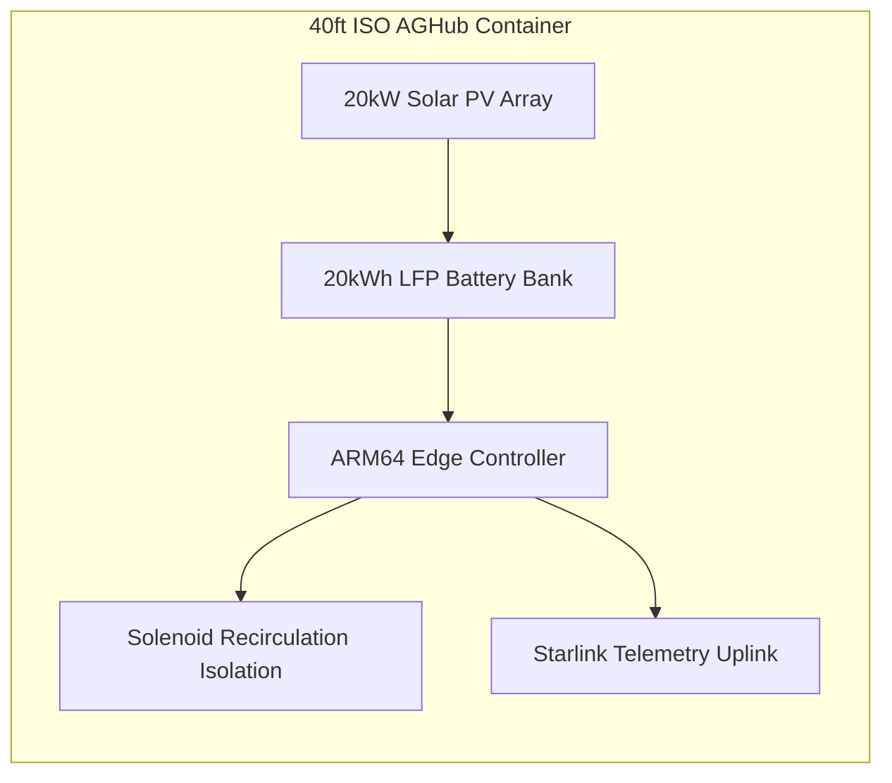

# Project Sol-Harvest: Containerized AGHub Network

Project Sol-Harvest is an open-source, industrial-grade agricultural microgrid system ("AGHub") designed to provide autonomous power, water desalination/recirculation, and environmental telemetry for off-grid operations worldwide.

---

## System Architecture & Technical Specifications

Each AGHub unit is housed within a reinforced 40ft ISO high-cube container engineered for rapid deployment in high-thermal, monsoonal, or mountainous environments.

