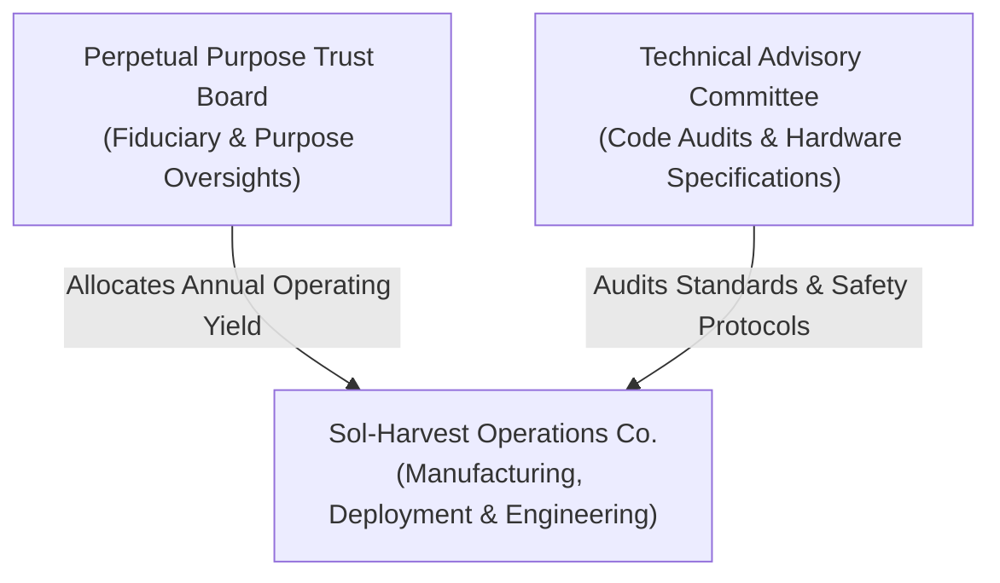

# OPERATIONAL GOVERNANCE & EXECUTIVE COMPENSATION CHARTER
**Document Ref:** GOV-OGC-2026-v1.0  
**Effective Date:** October 1, 2026  
**Applicability:** Sol-Harvest Foundation & Associated Operating Entities  

---

## 1. ORGANIZATIONAL STRUCTURE & MANAGEMENT

Project Sol-Harvest is governed by a dual-tier operational framework designed to segregate perpetual capital stewardship from day-to-day hardware manufacturing and field execution.

1.1 — Management Entities

    The Perpetual Purpose Trust Board: Serves as the ultimate fiduciary guardian. Holds no equity and enforces strict compliance with the Trust Charter, seed allocations, and open-source mandates.

    Operations Company (OpCo): The primary execution vehicle responsible for procurement, factory assembly, field logistics, software firmware maintenance, and Starlink telemetry monitoring.

2. EXECUTIVE COMPENSATION & SALARY CAP STRUCTURE

To ensure maximum capital efficiency and align leadership directly with humanitarian impact, executive compensation is subject to mandatory structural caps relative to the project's overall operational budget.

### 2.1 — Tiered Compensation Matrix

| Executive Role | Base Salary Cap | Max Variable Bonus | Performance Incentive Benchmark |
| :--- | :---: | :---: | :--- |
| **Chief Executive Officer (CEO)** | `$250,000 / yr` | `25%` ($62,500) | Unit deployment milestones & system uptime benchmarks |
| **Chief Technology Officer (CTO)** | `$225,000 / yr` | `25%` ($56,250) | Firmware safety trip SLA (<500ms) & open-source CAD releases |
| **Chief Operating Officer (COO)** | `$210,000 / yr` | `20%` ($42,000) | Supply chain cost efficiency ($1.315M/unit CapEx target) |
| **Regional Operations Leads** | `$140,000 / yr` | `15%` ($21,000) | Local 85/15 community yield distribution & regional site uptime |

2.2 — Executive Compensation Guiding Principles

    Zero Equity / Profit Shares: Because Sol-Harvest operates under a Perpetual Purpose Trust, no equity, stock options, or profit-sharing units are issued to executives or employees.

    Maximum Spread Ratio: The ratio between the highest-paid executive salary and the lowest-paid full-time field technician salary within the operating company shall not exceed 5:1.

    Bonus Calculation Metric: Variable performance bonuses are tied strictly to hardware uptime, community distribution efficiency, and open-source milestone releases—never to commercial sales volume.

3. ADMINISTRATIVE OVERHEAD & OPERATING EXPENSES (OpEx)

To ensure that funds remain dedicated to deployment and ongoing maintenance:

    Administrative Cap: Total administrative expenses (executives, legal, accounting, compliance, and office overhead) are strictly capped at ≤ 3.5% of the annual budget.

    Direct Field Allocation: A minimum of 96.5% of all operating funds disbursed from the Perpetual Trust yield must go directly toward hardware manufacturing, replacement parts, logistics, field labor, and local community sub-trust allocations.

4. CONFLICT OF INTEREST & ANTI-CORRUPTION POLICIES
4.1 — Vendor & Procurement Auditing

Executive officers, board members, and immediate family members are strictly prohibited from holding financial stakes in external hardware suppliers, logistics vendors, or service contractors bidding for AGHub manufacturing contracts.

All procurement contracts exceeding $100,000 USD require competitive bidding verified by the Technical Advisory Committee.
4.2 — Payroll Disbursement Security

Executive and staff salaries are disbursed via automated multi-signature workflows requiring independent verification from the Trust Auditor to prevent unapproved payroll expansion or unauthorized bonuses.
