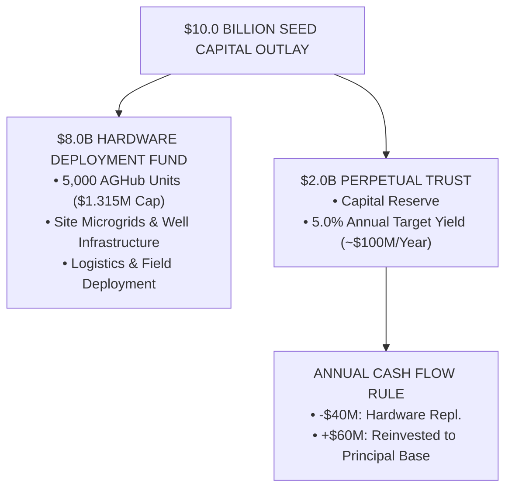

# CHARTER OF THE SOL-HARVEST PERPETUAL PURPOSE TRUST
**Document Ref:** GOV-PTC-2026-v1.0  
**Effective Date:** October 1, 2026  
**Jurisdiction:** Perpetual Non-Charitable Purpose Trust Framework  
**Open Source License:** MIT License  

---

## ARTICLE I: DECLARATION OF TRUST & PURPOSE

### Section 1.1 — Establishment
The **Sol-Harvest Perpetual Purpose Trust** (hereinafter referred to as the "Trust") is established as a non-charitable purpose trust dedicated exclusively to the perpetual funding, manufacturing, deployment, maintenance, and open-source protection of Project Sol-Harvest containerized agricultural microgrids ("AGHubs").

### Section 1.2 — Purpose Scope
The irrevocable core purposes of the Trust are as follows:
1. **Infrastructure Capitalization:** To deploy and maintain a global network of 5,000 AGHub units providing off-grid agricultural microgrid infrastructure.
2. **Perpetual Maintenance Yield:** To hold and steward a **$2.0 Billion USD Principal Reserve** in low-risk treasury instruments to fund ongoing hardware wear-and-tear in perpetuity.
3. **Open-Source Protection:** To ensure all CAD drawings, single-line wiring schematics, firmware source code, and mechanical blueprints associated with AGHub technology remain permanently available to the public under the MIT License without proprietary encumbrance.

---

## ARTICLE II: CAPITAL ALLOCATION & FINANCIAL MECHANICS

### Section 2.1 — Initial Seed Allocation ($10.0B CapEx)
The Trust acknowledges receipt of the initial $10.0 Billion USD Seed Outlay, which shall be strictly segregated into two operational funds:

### Section 2.2 — The 5.0% Yield Rule
The $2.0 Billion Perpetual Trust Reserve shall be managed under a strict capital preservation mandate, targeting a minimum 5.0% net annual dividend/yield (~$100 Million USD annually).

### Section 2.3 — Annual Disbursement Breakdown
Disbursements from the annual yield shall follow an unalterable waterfall structure:
* **Operating Maintenance Allocation ($40M/Year):** Capped at 40% of annual yield. Directly disbursed for component wear-and-tear, solar inverter replacements, battery degradation servicing, and emergency field repairs.
* **Inflation-Hedge Principal Reinvestment ($60M/Year):** Capped at 60% of annual yield. Reinvested directly into the principal reserve to ensure compound growth offsets inflation over multi-decade horizons.

---

## ARTICLE III: LOCAL ECONOMIC INTEGRATION & LOCAL TRUSTS

### Section 3.1 — The 85/15 Yield Distribution Model
To preserve local food economics and prevent agricultural market distortion, every deployed AGHub unit operates under an strict 85/15 output mandate:
1. **85% Free Community Distribution:** Reserved for direct allocation to local schools, hospitals, emergency relief networks, and community centers at zero financial cost.
2. **15% Local Commercial Allocation:** Offered to local retail merchants and agricultural co-operatives at fair prevailing local market rates.

### Section 3.2 — Ring-Fenced Local Community Trusts
**100% of commercial revenue** generated from the 15% commercial allocation shall be retained within a localized, ring-fenced community sub-trust.
* **Permitted Uses:** Payment of local field technician stipends, purchase of indigenous seed stock, site maintenance, and local water access rights.
* **Zero Capital Siphon:** No local commercial revenue may be remitted back to the parent Trust or external corporate entities.

---

## ARTICLE IV: GOVERNANCE, ANTI-CORRUPTION & TELEMETRY

### Section 4.1 — Multi-Signature Smart Contract Execution
All capital disbursements from the Trust to regional deployment vendors must be executed via hardware-linked multi-signature smart contracts requiring **4 of 6 cryptographic signatures** from:
* 1x Lead Systems Architect
* 1x Independent Financial Auditor
* 1x Regional Operations Director
* 1x Technical Verification Committee Representative
* 2x Independent Environmental/Humanitarian Trustees

### Section 4.2 — Zero-Trust Hardware Telemetry Verification
Fund releases for maintenance and replenishment are contingent upon automated, zero-trust telemetry verification streamed via Starlink from the target AGHub:
1. **Flowmeter Verification:** Pulse flowmeters must verify continuous closed-loop water recirculation without unflagged loss (>2% leak/siphon threshold).
2. **Power Generation Metrics:** BMS and inverter telemetry must confirm active PV generation and battery cycle health.
3. **Biomass AI Validation:** Optical edge sensors must confirm valid crop growth cycles prior to annual maintenance payout releases.

---

## ARTICLE V: AMENDMENT & DISSOLUTION

### Section 5.1 — Irrevocability of Core Purpose
The core purposes of this Trust—specifically the open-source release of hardware schematics, the prohibition of proprietary licensing, and the perpetual maintenance funding model—are **forever irrevocable**.

### Section 5.2 — Dissolution Clause
In the event that technological advances render physical AGHub units obsolete, the remaining Trust principal shall be transferred to a public open-source engineering fund dedicated exclusively to global water purification and off-grid renewable energy infrastructure.
